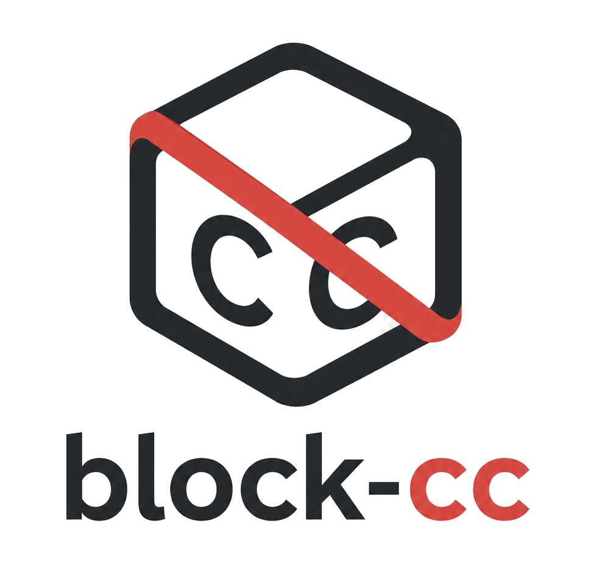
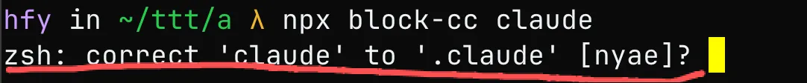

# block-cc



目标：更安全放心的使用 claude code（CLI），让 Anthropic 啥也采集不到，遥控我，门都没有！！

阻止 Claude Code 向 Anthropic 官方发送遥测、日志、更新检查等非必要网络请求，保护你的隐私数据。

当然你也没办法使用 claude 的官方模型，只能自定义 `ANTHROPIC_BASE_URL` 来使用 cc。

这个工具完全不影响本地的 claude code，这个是纯套壳~

## 无需安装，直接运行

```bash
npx block-cc claude
```

Claude Code 的所有额外参数会透传，比如：

```bash
npx block-cc claude -c          # 等同于 claude -c
```

## 原理

四层拦截，确保万无一失：

**第一层：环境变量关闭** — 注入开关（只做最小注入），从应用层禁用更新和反馈：

```
DISABLE_AUTOUPDATER=1
CLAUDE_CODE_DISABLE_UPDATE_CHECK=1
CLAUDE_CODE_DISABLE_FEEDBACK_SURVEY=1
```

**第二层：网络代理拦截** — 启动本地 HTTP CONNECT 代理，在 TLS 握手之前阻断必要的域名。

代理和环境变量均仅作用于 Claude Code 进程，不影响浏览器或其他应用。

保险起见，中转站域名也屏蔽掉了。

**第三层：TLS MITM 精确拦截** — 对 `claude.ai` 进行 TLS 中间人，精确到 URL 路径：

- `claude.ai` → 功能性请求全部伪造，不离开本机
- `claude.ai` → 其他非功能性所有请求都阻断

**第四层：离线扫描** - 定时离线扫描，只有更新版的 cc 完全没有 tcp 隧道直连和 udp 请求时，才允许通过。

目前实测没有发现 cc 有私自创建 tcp 隧道、打洞、非标 tcp 和 udp 请求，为了确保万无一失，block-cc 启动时会检查版本支持情况，如果存在疑似暗门的 cc 版本，直接跳过。


## 环境要求

- Node.js >= 18
- Claude Code 已安装

## 特点

- 零依赖，仅使用 Node.js 标准库
- 跨平台（macOS / Linux / Windows）
- 随 Claude Code 退出自动清理代理

通过 `npx block-cc claude` 运行起来后，日志会写到 `~/.config/block-cc/block-cc.log`里。

## 避免启动提示

如果你觉得这个提示很烦



可以这样启动，在`~/.zshrc`里加上快捷方式：

### 1）方式一，重定义`block-cc`命令

```
alias block-cc='nocorrect npx block-cc'
```

然后这样启动：

```
block-cc claude
```

### 2）方式二，重定义 `claude` 命令 

或者你想更彻底重写 claude 命令，这样配~/.zshrc：

```
claude() {
  nocorrect npx block-cc claude "$@"
}
```

这样就更清净了！！

> 纯学习探讨用
